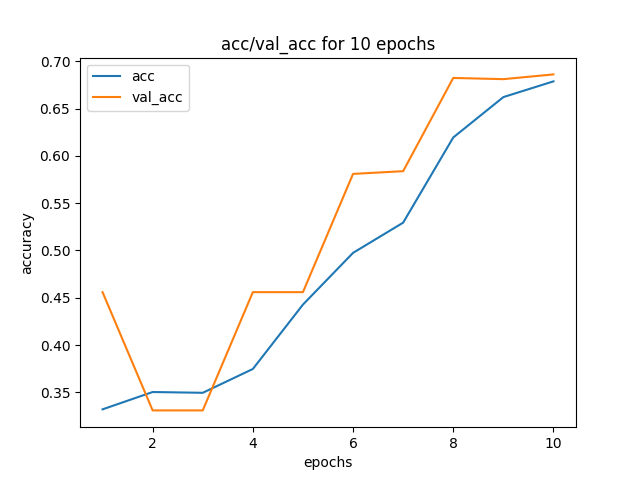
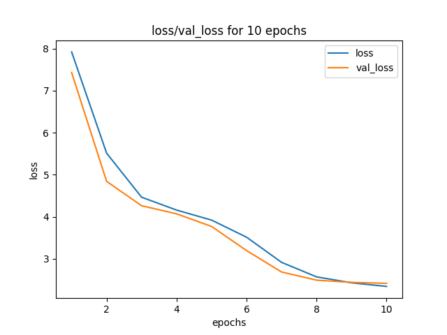

# Experimental Report for dt_lgth:4350

---

Test on:

epochs: [128]

gru_neurons: [2, 5, 10]

---

# Parameters

* batch_size : 300

* validation_split : 0.2

* dataset_path : ./datasets/

* learning_rate : 0.001

* dropout_value : 0.5

* dense_neurons : 128

* loss_function : sparse_categorical_crossentropy

* dataset_length : 4350

* percentage True Negatives : 21.4

* percentage names only : None

* percentage other tags : None

 

# GRU: 128 - Epochs: 2

## Learning curves

|          |      Training data      |  Validation data |
|:--------:|:-----------------------:|:----------------:|
| minimum  | 0.27 | 0.26 |
| maximum  | 0.69 | 0.71 |
|   mean   | 0.51 | 0.5 |

|          |      Training data      |  Validation data |
|:--------:|:-----------------------:|:----------------:|
| minimum  | 0.27 | 0.26 |
| maximum  | 0.68 | 0.71 |
|   mean   | 0.51 | 0.5 |

## Fitting observations

|          | Undefitting | Good fitting | Overfitting |
|:--------:|:-----------:|:------------:|:-----------:|
|  Status  | Yes | Partially | No |

## Predictions

|          | Seq. to predict | Expected seq. | Predicted seq. |
|:--------:|:---------------:|:-------------:|:--------------:|
|  Seq.  | <authors author:'John Da'/> | author: 'John Da' | author: 'Mr. Luc Da' |

## Bilan
For 128 neurons in GRU and 2 epochs, the training accuracy is gapped at 0.69, the training loss at 0.68. The model is underfitted and the prediction is correct at 56%.

# GRU: 128 - Epochs: 5

## Learning curves

|          |      Training data      |  Validation data |
|:--------:|:-----------------------:|:----------------:|
| minimum  | 0.27 | 0.26 |
| maximum  | 0.69 | 0.71 |
|   mean   | 0.51 | 0.5 |

|          |      Training data      |  Validation data |
|:--------:|:-----------------------:|:----------------:|
| minimum  | 0.27 | 0.26 |
| maximum  | 0.68 | 0.71 |
|   mean   | 0.51 | 0.5 |

## Fitting observations

|          | Undefitting | Good fitting | Overfitting |
|:--------:|:-----------:|:------------:|:-----------:|
|  Status  | Yes | Partially | No |

## Predictions

|          | Seq. to predict | Expected seq. | Predicted seq. |
|:--------:|:---------------:|:-------------:|:--------------:|
|  Seq.  | <authors author:'John Da'/> | author: 'John Da' | author: 'Mr. Luc Da' |

## Bilan
For 128 neurons in GRU and 5 epochs, the training accuracy is gapped at 0.69, the training loss at 0.68. The model is underfitted and the prediction is correct at 56%.

# GRU: 128 - Epochs: 10

## Learning curves

|          |      Training data      |  Validation data |
|:--------:|:-----------------------:|:----------------:|
| minimum  | 0.27 | 0.26 |
| maximum  | 0.69 | 0.71 |
|   mean   | 0.51 | 0.5 |

|          |      Training data      |  Validation data |
|:--------:|:-----------------------:|:----------------:|
| minimum  | 0.27 | 0.26 |
| maximum  | 0.68 | 0.71 |
|   mean   | 0.51 | 0.5 |

## Fitting observations

|          | Undefitting | Good fitting | Overfitting |
|:--------:|:-----------:|:------------:|:-----------:|
|  Status  | Yes | Partially | No |

## Predictions

|          | Seq. to predict | Expected seq. | Predicted seq. |
|:--------:|:---------------:|:-------------:|:--------------:|
|  Seq.  | <authors author:'John Da'/> | author: 'John Da' | author: 'Mr. Luc Da' |

## Bilan
For 128 neurons in GRU and 10 epochs, the training accuracy is gapped at 0.69, the training loss at 0.68. The model is underfitted and the prediction is correct at 56%.

# Model Summary
Model: "sequential_2"
_________________________________________________________________
Layer (type)                 Output Shape              Param #   
embedding_2 (Embedding)      (None, 8, 100)            309000    
_________________________________________________________________
gru_4 (GRU)                  (None, 8, 128)            88320     
_________________________________________________________________
dropout_6 (Dropout)          (None, 8, 128)            0         
_________________________________________________________________
gru_5 (GRU)                  (None, 8, 128)            99072     
_________________________________________________________________
dropout_7 (Dropout)          (None, 8, 128)            0         
_________________________________________________________________
time_distributed_4 (TimeDist (None, 8, 256)            33024     
_________________________________________________________________
dropout_8 (Dropout)          (None, 8, 256)            0         
_________________________________________________________________
time_distributed_5 (TimeDist (None, 8, 3078)           791046    
Total params: 1,320,462
Trainable params: 1,320,462
Non-trainable params: 0
_________________________________________________________________

# Plotted Model
