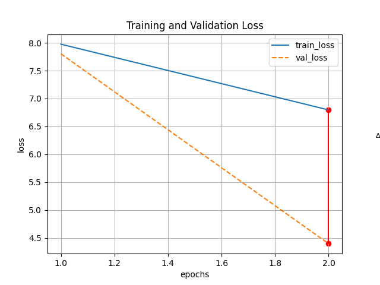
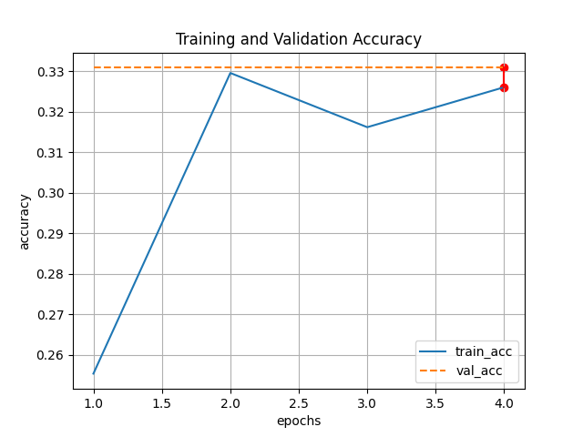
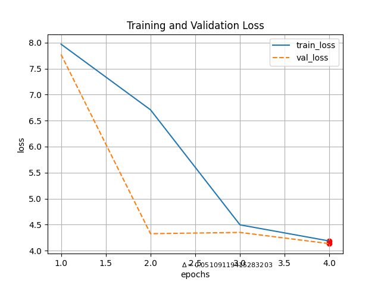
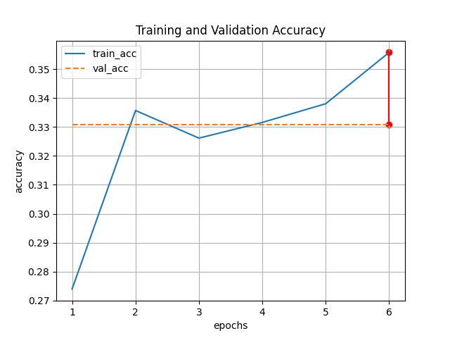
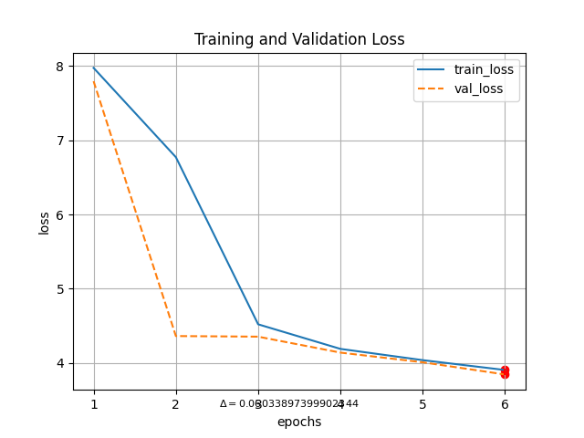
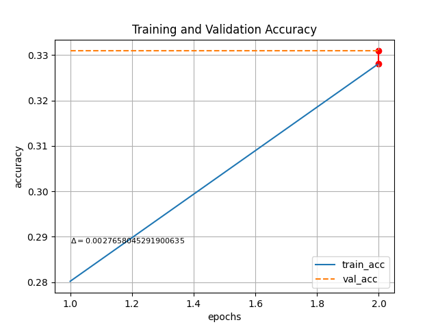
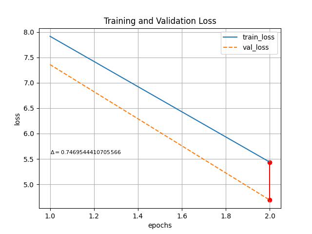
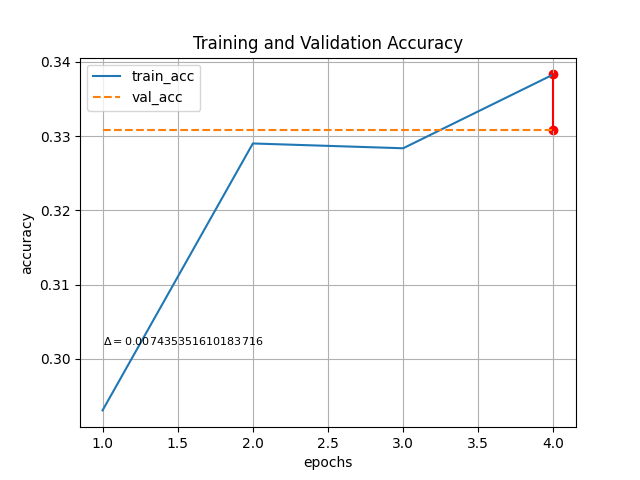
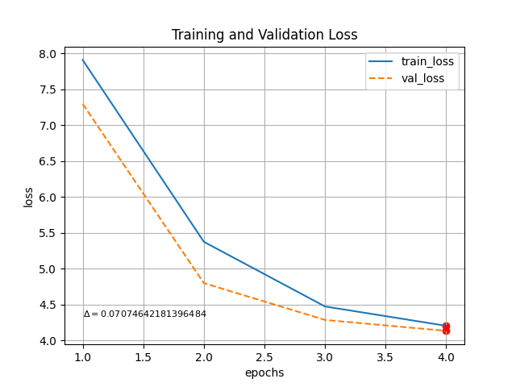
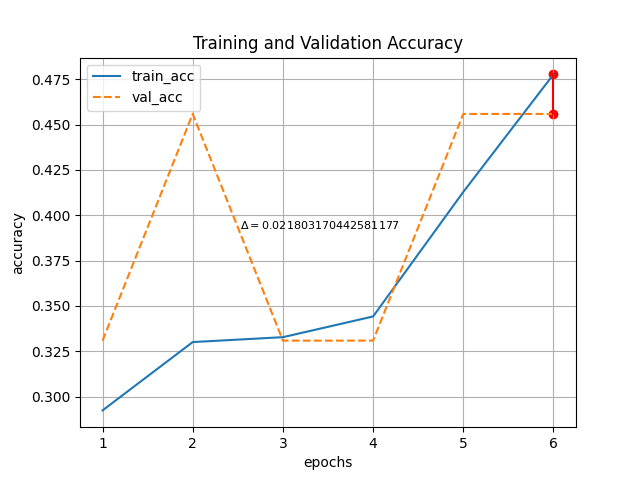

# Experimental Report for dt_lgth:4350

&nbsp;&nbsp;&nbsp;&nbsp;&nbsp;&nbsp;&nbsp;&nbsp;&nbsp;&nbsp;&nbsp;&nbsp;&nbsp;&nbsp;&nbsp;&nbsp;&nbsp;&nbsp;&nbsp;&nbsp;&nbsp;&nbsp;&nbsp;&nbsp;&nbsp;&nbsp;&nbsp;&nbsp;&nbsp;&nbsp;&nbsp;&nbsp;&nbsp;&nbsp;&nbsp;&nbsp;&nbsp;&nbsp;&nbsp;&nbsp;&nbsp;&nbsp;&nbsp;&nbsp;&nbsp;&nbsp;&nbsp;&nbsp;&nbsp;&nbsp;&nbsp;&nbsp;&nbsp;&nbsp;&nbsp;&nbsp;&nbsp;&nbsp;&nbsp;&nbsp;&nbsp;&nbsp;&nbsp;&nbsp;&nbsp;&nbsp;&nbsp;&nbsp;&nbsp;&nbsp;&nbsp;&nbsp;&nbsp;&nbsp;&nbsp;&nbsp;Test on:

&nbsp;&nbsp;&nbsp;&nbsp;&nbsp;&nbsp;&nbsp;&nbsp;&nbsp;&nbsp;&nbsp;&nbsp;&nbsp;&nbsp;&nbsp;&nbsp;&nbsp;&nbsp;&nbsp;&nbsp;&nbsp;&nbsp;&nbsp;&nbsp;&nbsp;&nbsp;&nbsp;&nbsp;&nbsp;&nbsp;**gru_neurons**: [64, 128]&nbsp;&nbsp;&nbsp;&nbsp;&nbsp;&nbsp;&nbsp;&nbsp;&nbsp;&nbsp;&nbsp;&nbsp;&nbsp;&nbsp;&nbsp;&nbsp;&nbsp;&nbsp;&nbsp;&nbsp;&nbsp;&nbsp;&nbsp;&nbsp;&nbsp;&nbsp;&nbsp;&nbsp;&nbsp;&nbsp;&nbsp;&nbsp;&nbsp;&nbsp;&nbsp;&nbsp;&nbsp;&nbsp;&nbsp;&nbsp;
&nbsp;&nbsp;&nbsp;&nbsp;&nbsp;&nbsp;&nbsp;&nbsp;&nbsp;&nbsp;**epochs**: [2, 4, 6]
# Parameters

* batch_size : 300

* validation_split : 0.2

* dataset_path : ./datasets/

* learning_rate : 0.001

* dropout_value : 0.5

* dense_neurons : 128

* loss_function : sparse_categorical_crossentropy

* dataset_length : 4350

* percentage True Negatives : 21.4

* percentage names only : None

* percentage other tags : None

# Vocab infos

|Metric|In vocab|Out vocab|
|:------:|:------:|:-------:|
|Total nb. of words|32054|23345|
|Nb. of unique words|3090|3078|
|Max seq. length|9|8|
|Vocab size|3089|3077|
|% True Negatives|24.1|24.1|
|% no title|None|None|

   

# GRU: 64 - Epochs: 2

## Learning curves

|          |      Training data      |  Validation data |
|:--------:|:-----------------------:|:----------------:|
| minimum  | 0.27 | 0.26 |
| maximum  | 0.69 | 0.71 |
|   mean   | 0.51 | 0.5 |

|          |      Training data      |  Validation data |
|:--------:|:-----------------------:|:----------------:|
| minimum  | 0.27 | 0.26 |
| maximum  | 0.68 | 0.71 |
|   mean   | 0.51 | 0.5 |

## Fitting observations

|          | Undefitting | Good fitting | Overfitting |
|:--------:|:-----------:|:------------:|:-----------:|
|  Status  | Yes | Partially | No |

## Predictions

|          | Seq. to predict | Expected seq. | Predicted seq. |
|:--------:|:---------------:|:-------------:|:--------------:|
|  Seq.  | <authors author:'John Da'/> | author: 'John Da' | author: 'Mr. Luc Da' |

## Bilan
For **64** neurons in GRU and **2** epochs, the training accuracy is gapped at **0.69**, the training loss at **0.68**. The model is **underfitted** and the prediction is correct at **56%**.
  

# GRU: 64 - Epochs: 4

## Learning curves

|          |      Training data      |  Validation data |
|:--------:|:-----------------------:|:----------------:|
| minimum  | 0.27 | 0.26 |
| maximum  | 0.69 | 0.71 |
|   mean   | 0.51 | 0.5 |

|          |      Training data      |  Validation data |
|:--------:|:-----------------------:|:----------------:|
| minimum  | 0.27 | 0.26 |
| maximum  | 0.68 | 0.71 |
|   mean   | 0.51 | 0.5 |

## Fitting observations

|          | Undefitting | Good fitting | Overfitting |
|:--------:|:-----------:|:------------:|:-----------:|
|  Status  | Yes | Partially | No |

## Predictions

|          | Seq. to predict | Expected seq. | Predicted seq. |
|:--------:|:---------------:|:-------------:|:--------------:|
|  Seq.  | <authors author:'John Da'/> | author: 'John Da' | author: 'Mr. Luc Da' |

## Bilan
For **64** neurons in GRU and **4** epochs, the training accuracy is gapped at **0.69**, the training loss at **0.68**. The model is **underfitted** and the prediction is correct at **56%**.
  

# GRU: 64 - Epochs: 6

## Learning curves

|          |      Training data      |  Validation data |
|:--------:|:-----------------------:|:----------------:|
| minimum  | 0.27 | 0.26 |
| maximum  | 0.69 | 0.71 |
|   mean   | 0.51 | 0.5 |

|          |      Training data      |  Validation data |
|:--------:|:-----------------------:|:----------------:|
| minimum  | 0.27 | 0.26 |
| maximum  | 0.68 | 0.71 |
|   mean   | 0.51 | 0.5 |

## Fitting observations

|          | Undefitting | Good fitting | Overfitting |
|:--------:|:-----------:|:------------:|:-----------:|
|  Status  | Yes | Partially | No |

## Predictions

|          | Seq. to predict | Expected seq. | Predicted seq. |
|:--------:|:---------------:|:-------------:|:--------------:|
|  Seq.  | <authors author:'John Da'/> | author: 'John Da' | author: 'Mr. Luc Da' |

## Bilan
For **64** neurons in GRU and **6** epochs, the training accuracy is gapped at **0.69**, the training loss at **0.68**. The model is **underfitted** and the prediction is correct at **56%**.
  
# Model Summary
Model: "sequential_2"
_________________________________________________________________
Layer (type)                 Output Shape              Param #   
embedding_2 (Embedding)      (None, 8, 100)            309000    
_________________________________________________________________
gru_4 (GRU)                  (None, 8, 64)             31872     
_________________________________________________________________
dropout_6 (Dropout)          (None, 8, 64)             0         
_________________________________________________________________
gru_5 (GRU)                  (None, 8, 64)             24960     
_________________________________________________________________
dropout_7 (Dropout)          (None, 8, 64)             0         
_________________________________________________________________
time_distributed_4 (TimeDist (None, 8, 256)            16640     
_________________________________________________________________
dropout_8 (Dropout)          (None, 8, 256)            0         
_________________________________________________________________
time_distributed_5 (TimeDist (None, 8, 3078)           791046    
Total params: 1,173,518
Trainable params: 1,173,518
Non-trainable params: 0
_________________________________________________________________
                   
# Plotted Model

# GRU: 128 - Epochs: 2

## Learning curves

|          |      Training data      |  Validation data |
|:--------:|:-----------------------:|:----------------:|
| minimum  | 0.27 | 0.26 |
| maximum  | 0.69 | 0.71 |
|   mean   | 0.51 | 0.5 |

|          |      Training data      |  Validation data |
|:--------:|:-----------------------:|:----------------:|
| minimum  | 0.27 | 0.26 |
| maximum  | 0.68 | 0.71 |
|   mean   | 0.51 | 0.5 |

## Fitting observations

|          | Undefitting | Good fitting | Overfitting |
|:--------:|:-----------:|:------------:|:-----------:|
|  Status  | Yes | Partially | No |

## Predictions

|          | Seq. to predict | Expected seq. | Predicted seq. |
|:--------:|:---------------:|:-------------:|:--------------:|
|  Seq.  | <authors author:'John Da'/> | author: 'John Da' | author: 'Mr. Luc Da' |

## Bilan
For **128** neurons in GRU and **2** epochs, the training accuracy is gapped at **0.69**, the training loss at **0.68**. The model is **underfitted** and the prediction is correct at **56%**.
  

# GRU: 128 - Epochs: 4

## Learning curves

|          |      Training data      |  Validation data |
|:--------:|:-----------------------:|:----------------:|
| minimum  | 0.27 | 0.26 |
| maximum  | 0.69 | 0.71 |
|   mean   | 0.51 | 0.5 |

|          |      Training data      |  Validation data |
|:--------:|:-----------------------:|:----------------:|
| minimum  | 0.27 | 0.26 |
| maximum  | 0.68 | 0.71 |
|   mean   | 0.51 | 0.5 |

## Fitting observations

|          | Undefitting | Good fitting | Overfitting |
|:--------:|:-----------:|:------------:|:-----------:|
|  Status  | Yes | Partially | No |

## Predictions

|          | Seq. to predict | Expected seq. | Predicted seq. |
|:--------:|:---------------:|:-------------:|:--------------:|
|  Seq.  | <authors author:'John Da'/> | author: 'John Da' | author: 'Mr. Luc Da' |

## Bilan
For **128** neurons in GRU and **4** epochs, the training accuracy is gapped at **0.69**, the training loss at **0.68**. The model is **underfitted** and the prediction is correct at **56%**.
  

# GRU: 128 - Epochs: 6

## Learning curves

|          |      Training data      |  Validation data |
|:--------:|:-----------------------:|:----------------:|
| minimum  | 0.27 | 0.26 |
| maximum  | 0.69 | 0.71 |
|   mean   | 0.51 | 0.5 |

|          |      Training data      |  Validation data |
|:--------:|:-----------------------:|:----------------:|
| minimum  | 0.27 | 0.26 |
| maximum  | 0.68 | 0.71 |
|   mean   | 0.51 | 0.5 |

## Fitting observations

|          | Undefitting | Good fitting | Overfitting |
|:--------:|:-----------:|:------------:|:-----------:|
|  Status  | Yes | Partially | No |

## Predictions

|          | Seq. to predict | Expected seq. | Predicted seq. |
|:--------:|:---------------:|:-------------:|:--------------:|
|  Seq.  | <authors author:'John Da'/> | author: 'John Da' | author: 'Mr. Luc Da' |

## Bilan
For **128** neurons in GRU and **6** epochs, the training accuracy is gapped at **0.69**, the training loss at **0.68**. The model is **underfitted** and the prediction is correct at **56%**.
  
# Model Summary
Model: "sequential_5"
_________________________________________________________________
Layer (type)                 Output Shape              Param #   
embedding_5 (Embedding)      (None, 8, 100)            309000    
_________________________________________________________________
gru_10 (GRU)                 (None, 8, 128)            88320     
_________________________________________________________________
dropout_15 (Dropout)         (None, 8, 128)            0         
_________________________________________________________________
gru_11 (GRU)                 (None, 8, 128)            99072     
_________________________________________________________________
dropout_16 (Dropout)         (None, 8, 128)            0         
_________________________________________________________________
time_distributed_10 (TimeDis (None, 8, 256)            33024     
_________________________________________________________________
dropout_17 (Dropout)         (None, 8, 256)            0         
_________________________________________________________________
time_distributed_11 (TimeDis (None, 8, 3078)           791046    
Total params: 1,320,462
Trainable params: 1,320,462
Non-trainable params: 0
_________________________________________________________________
                   
# Plotted Model
